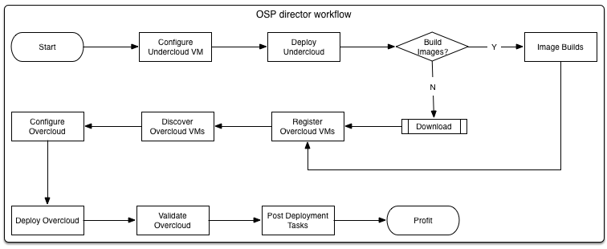

# OSP director 功能 & 路线图

## 序言

## 下一章

这一节概述，并详细介绍了当前的 OSP 主任 * * 功能 * * 时的第一次一般可用性 (GA) 与 * * RHEL OSP 7.0 (Kilo) * *，它也进入了当前已知的限制以及如何减轻对他们的一些。我们也会进入某些路线图项添加额外的功能。请注意，路线图是不断在基于 **客户要求** 而改变，所以请您将 **建议** 和 **请求**反馈到 [PM 团队] (virt-field-pm@redhat.com) 。

正如所有的 Red Hat 技术，是有相对应的 **上游** 项目，"**RDO 经理**"我们专注于 **上游第一** 发展模式;所有功能都推向上游 RDO 经理和各自的上游 OpenStack 存储库拉下来之前我们 **下游** RHEL OSP 主任提供。详细信息可以在这里找到:

* [Project Overview] (https://www.rdoproject.org/RDO-Manager)
* [Git Repository] (https://www.github.com/rdo-management)
* 如果你想要 [贡献] (https://repos.fedorapeople.org/repos/openstack-m/docs/master/contributions/contributions.html#contributing-code) ，我们欢迎您的参与！  

## OSP director 工作流程

一般 **流** OSP 导演时部署与 **虚拟硬件** 是，如下所示:

## 一般可用性功能

这个 enablement 的 OSP 主任在 GA RHEL OSP 7.0 状态附近集中，是 **第一** 迭代的工具。与 *快速* 上游释放节奏的底层核心 OpenStack 组件，我们已经 **优先** 某些功能进入遗传算法与其他项目留下的路线图中 **每2月的发放节奏** 的 OSP 主任。GA 释放的共同主题已经 **一致性** 我们现有的部署与 **最佳-做法**;因此，OSP 导演的部署环境，应为 **相同** 的 RHEL OSP 安装程序部署环境 (**Staypuft**)。正如所说，OSP 主任已经被设计为更多 **灵活**、 更多 **综合**，和更多 **可扩展** 比以前的工具。

发射时，我们有以下功能:
1. 共同的 **对于 undercloud 部署统一的 CLI** 和 **overcloud** 。使用熟悉的本机 OpenStack 工具，我们能够部署基础部署云，以及生产云，使用共同的基础 **API**。
2. 一个 **WebUI** 为 overcloud 部署 (如果 **Tuskar** 正在使用)，但这是可能是 **弃用** post-GA和等效的 UI 将需要提供。
3. 自动 **健康检查**，**基准**，和 **的角色分配** 基于节点的特性。这给了我们的能力，以确保我们充分利用我们的硬件并能够识别表现低于预期的衡量任何设备。
4. **准备状态** 的节点的配置。这提供了一种机制的 **预配置** 的硬件状态下的节点，我们想要提供，例如，我们可以设置 **RAID 配置**、 启用特定 **BIOS** 设置 (例如VT-x)，和甚至配置 **网络** 所有 *之前* 部署操作系统。请注意，此功能需要支持硬件;并不是所有的硬件平台支持此功能，是依赖于 **Ironic的支持**。不支持泛型 IPMI 的准备状态。
5. 部署的能力 **高度可用**，**多控制器** RHEL OSP 环境基于现有的HA参考体系结构，利用 **起搏器** 和 **HAproxy** 的服务可用性和恢复能力。
6. **轻度集成** Red Hat **卫星**。今天，我们有与卫星集成作为内容的存储;我们做 **不** 使用卫星为裸金属资源调配，但我们有能力，有主机 **自动注册** 资产跟踪和 **订阅消费** 提供 **初始** 包安装，喙和最后提供的来源 ** 更新/补丁程序/勘误表**，我们可以从拉部署生命周期期间。
7. 自动 **理智检查** 在部署过程中。整个部署 OSP 主任将确保组件与所需的配置，正确布置和最后检查 **API 整合** 和 OpenStack **功能** 利用 **Tempest**。
8. 能力 **overcloud** 规模。我们所关注的大量业务/每天任务与 OSP 导演 — — 经营者会想要做的主要事情之一就是到 **增加容量** 在必要时，我们可以增加节点数目 *每个角色*。现在，我们只能做这与 **存储** (基于 Ceph 的) 和 **计算** 节点，但其目的是要在晚些时候支持控制器缩放。请注意，turning非HA环境到HA环境是 **不支持**。
9. **自动升级** 之间 *专业* 版本在 RHEL OSP **overcloud**。一件事是以前部署工具不能容纳的能力都 **补丁** 和 **升级** 主要 RHEL OSP 版本。OSP 导演我们会有这种能力。请注意，OSP 主任 **不能** 部署**先于7.0**版本的 RHEL OSP ，因此此功能不能使用目前。大部分的功能会用 RHEL OSP 8.0 交付。
10. 自动 **部署** 和 **集成** 的 **Ceph**。Ceph 存储后端现在是 **默认** 和 *推荐* RHEL OSP 的存储后端。OSP 主任可以部署和扩展 Ceph，为 **块** **ephemeral** 和 **镜像**存储。根据以前的部署工具，Ceph 监视器驻留在控制器上。
11. 技术预览进入 **操作工具**。OSP 主任执行背后的主要驱动力之一是采取我们过去只部署工具 — — 我们想要向运营团队，提供工具让他们明白到底如何经营他们的云。因此，我们正在实施 **集中式日志记录**，监视组件为他们 **可用性** 与 **alarming** 能力，和正在进行 **性能** 基准。请注意，一些这些工具会送点版本中 **post-GA**。

## 前线查明的差距

在引领 GA 的 OSP 主任、 工程和产品管理从事与 OpenStack 前线小组 EMEA 和北美地区，转达了 OSP 主任架构和其当前的功能，并具有一系列出来 **最高优先级功能**，我们必须解决在路线图。这背后的想法是要不仅开始获取反馈 **之前** 产品 (我们不设法做以前做的东西) 的版本，而是为了创造一个反馈回路，确保当我们进步与 OSP 导演我们不断地包括他们的评论的字段和功能开发的请求。

虽然它很大程度上是 *晚* 影响遗传算法的 OSP 主任，领域提供重要的反馈财富和列表的 **关键功能** 我们不得不已实现，主要基于我们部署架构限制 OpenStack 的能力和累积起来具有竞争力的解决方案。排名前五位请求来自前线，OSP 主任在遗传算法中已经包含不是如下:

1. 灵活和 **定制角色**-的能力 **定义您自己的角色** 以外的单片机控制器、 计算、 网络和存储的角色。通常情况下，客户可能需要 **片段** 其体系结构以支持 **规模** 和容错能力，或要使用的 **融合** 体系结构。我们应该使客户能够做到这一点。
2. **可扩展性** 第三方集成。该字段要求是一种机制供应商的插头为部署和集成的支持他们 **值添加组件** 通过 **插件接口** 。例如，Cinder或Neutron插件的支持目前需要有 *手动* 写，而与插件接口供应商和顾问可以编写必要的代码以进行部署 *自动*。
3. 能力 **描述** 环境配置文件中的 (类似于 Packstack 的 **答案文件** 概念)，以便 **可移植性** 和 **易用性** 的 overcloud 配置。今天，需要在配置更改 **** yaml 格式的文件，可能很难与语法和理解。有了这个功能它也可能帮助我们部署环境中的 **可重复** 模式，例如用于灾难恢复或测试。
4. 快速设置机制 **具体覆盖参数**，要么 *预先部署* 或 *部署后*。通常，我们需要让 **单** 配置更改为也许并不通过 CLI/UI 公开部署或 (如果适用) 答案文件。更新参数数目可能是设置的部署工具和将设置 (或在现有环境的情况下更新) 这样的配置，而无需破解 **模板** 或Puppet **体现** 自己。

例如，更新 **全局** CPU Nova中的值:

  ~~~
  # openstack overcloud config-set "nova_compute:cpu_allocation_ratio=32" --global
  ~~~

或者如果 **特定节点** 需要更新:

    ~~~
    # openstack overcloud config-set "neutron_l3:external_network_bridge=br-provider"       --nodes=11e522f0-9c80-4219-9b98-c15db243ef0d,
                20193d06-4319-4826-a348-676a99cd2a0c,
                51ee2c1f-e0d6-401c-bd16-493191ee8b53
    ~~~
  
> **注意**: 这些不过是 **例子** 如何的事情 **能** 工作，**不** 在当前实现中的功能。

虽然它是更多的 **核心** 和 **平台** 问题，有一些客户希望我们默认的替代 **起搏器** 根据HA的办法;一个选择是将其替换为 **keepalived** 基于解决方案。我们应该正式支持这种类型的配置，我们的模具也必须能够部署这种体系结构。这将意味着更多 *基本* 在转移的方式，我们不仅 **开始** 和 **在群集上，但是我们如何设置关键组件，如服务恢复** ** RabbitMQ** 和 **Galera** 了，这两种需要 *创* 和 *控制* 配置和初始 **引导**。

## OSP director 路线图

那么我们可以在接下来的几期待什么 * 点发布 *，和 * 主要 * 版本的 OSP 主任?
下面我会合并的列表中的新功能 * * 路线图 * *，有被收集起来，作为查明差距的上面列出，并且我们未能进入GA的东西此列表是 **不是详尽无遗**，但涵盖了主要的功能，我们的目标:

1. 而不是直接部署在主机上的服务，打算最终我们将能够运行 overcloud 内的服务 **容器**，协助部署灵活性、 性能和可升级性。
    预期: **RHEL OSP 9.0** 时间表 (目前待定)
2. 虽然已经提到上面，作为 ' *交付*' 功能 GA 的 OSP 导演，我们正在大量集中是否能够运行 **主要版本升级** 在路线图。容器技术的 overcloud 服务 *能* 也在这里帮助我们。
    预期: **RHEL OSP 8.0** (当我们实际上有一个版本升级到)
3. 我们计划能够支持 **可组合角色**，即自定义角色，第一个顶部 **字段要求** 要牢固放在路线图 。我们需要一种机制来脱离 **单片** 和标准的角色，我们部署与今天，使 **灵活的服务位置**。
    预期: **TBD**-它是高度优先事项，但我们还不确定的时候我们可以提供这一点。
4. 我们想要提供一种机制，用于向第三方 **集成** 他们与外框，支持 OSP 导演认证的解决方案，集成。它的目的，我们会支持 **Cinder** 和 **Neutron** 首先，或许延长这出到别人在可行的情况。这个路线图项目也来自上面前线的要求。
    预期: **RHEL OSP 7.x 点释放**-在未来 6 个月内
5. 再次，从上面的字段要求，请求 **先进的 parametisation** 已被列入路线图 ，允许在每个节点的基础上指定的某些局部参数。如何做到这一点仍坚定的和它是不可能要我如何显示在上面的例子，但很坚定地对路线图。
    预期: **RHEL OSP 主任 7.1** (先点发布)
6. 我们本来希望采取从 SpinalStack 的一个附加功能是 * * 分布式自动健康检查 (DAHC) * * 执行。到目前为止，我们已经讨论了 (非分布式) AHC，它是使用基准系统和帮助 * * 角色分配 * *，但这对执行 * 单节点 * 在一段时间。* * 分布式 * * 模式以此进一步和基准硬件系统的基础相互关联，例如* * 网络吞吐量 * * 之间您环境中的系统。DAHC 自动编排系统的基准和允许数据可查看使用 **Cardiff** 工具。
    预期: **RHEL OSP 7.x 点释放**-在未来 6 个月内
7. 下面就从以前 **DAHC** 路线图元，DAHC 是重要的基础硬件基准测试 **之前** OpenStack 部署发生。什么客户不知道是 OpenStack 将如何执行的一旦它正在运行。因为模具的 OSP 主任为了援助运作管理已部署环境中，我们打算支持 **集会**，上游 OpenStack 组件，使客户能够评估他们的云将如何工作在某些情况下，例如**规模** 和 **高使用率**。它旨在集会将成为一部分的 ** CI / CD ** 工具链，以便可以部署和基准与给定配置两个环境 **验证** 和 **提高** OpenStack。
    预期: **RHEL OSP 8.0**
8. 再次，在顶部字段要求确定，将我们需要起搏器只有医管局支持替代我们 RHEL OSP 分布。我们打算在提供支持与两个 **核心** 和 **主任** 元素，使用户能够选择他们是否希望 *传统* 起搏器基于部署或跟另一种方法去 **keepalived**-基础配置。
    预期: **RHEL OSP 主任 7.2** (第二点发布)
9. 来自最高的领域要求的最终要求是 **的答案-文件** 即基于部署，描述环境，配置文件允许 **可移植性**，**重复性** 和 **易用性** 的配置。这有的优先次序内最新的路线图。
    预期: **RHEL OSP 8.0**，然而大量的这项工作已经开始。
10. 今天，每个 undercloud 只能部署 **一** overcloud;它有 **硬编码** 工具部署 (和管理) **热-堆栈** 命名为 'overcloud'。许多客户想要的能力为单一的 undercloud 能够部署和管理多个 overclouds 与 **单** undercloud。
    预期: **RHEL OSP 8.0**

## 下一章

我们开始 **hands-on labs**; 我们会经过很多细节内容中，将理论付诸实践。让我们确保我们有足够连接到已设置的专用实验室，请点击 [这里][labs-setup](./labs-setup.md) 
