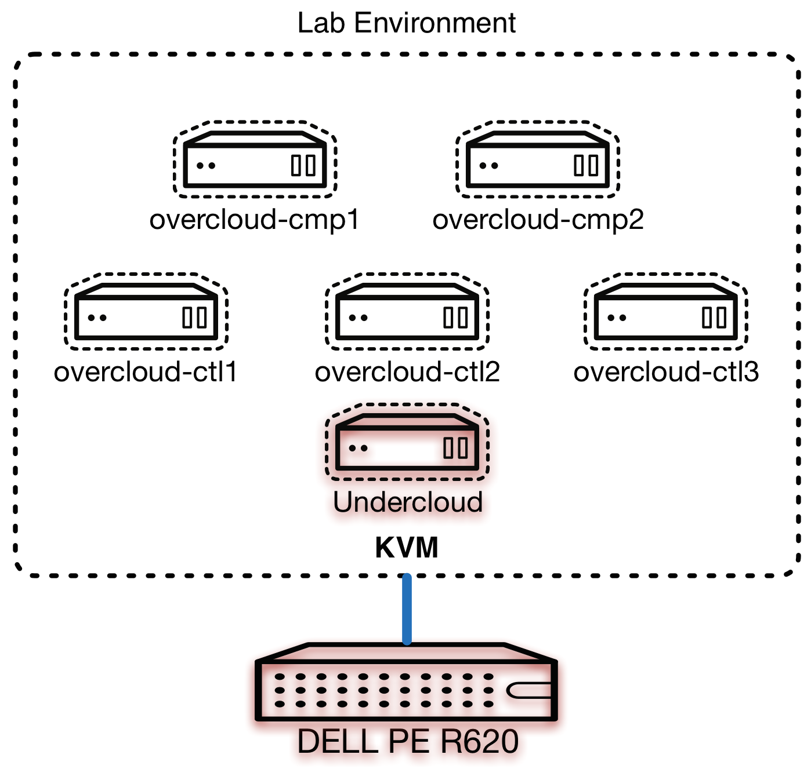

# 实验一 :  准备部署主机

## 序言

欢迎来到了动手实验!毫无疑问，这将是最最 **重要** 部分的支持;确保你可以把 **理论变成实践** 和建立在您现有的 OpenStack 专门知识与一些 OSP 主任经验!

在这一章中，我们要去执行以下任务来准备你潜在的裸金属机 (**主机**) 运行 underclound 和 overcloud。我们假定你在追随这些材料以提供 **专用** 中的硬件 **讲师** 环境;如果你使用的这些材料用于 **自学** 学习，指令的设计执行后用干净的单个裸金属主机 **RHEL 7.1 最小** 安装。

我们要进行以下任务在这个实验室中，估计的完成时间的 **45 分钟**:
* 配置主机提供所需的 **包** 和 **服务**
* 配置所需的 **逻辑虚拟网络** 来表示现实世界网络
* 配置 **虚拟机**，将成为您 **undercloud** 节点
* 确保 undercloud 节点的连通性和网络验证

> **注意**: 此实验室开始假定您已经完成非常小的先决条件才能连接到您底层的裸露金属主机，[上一页] [实验室安装] 章中详细说明。

## Lab Focus

这个实验室将集中于 **底层主机** (hypervisor) 和初始的 VM 将成为 undercloud 机:

    

## Required Packages

我们要使用这个主机作为一个管理程序，我们会在运行所有的虚拟机和网络需要模仿真实的客户环境，我们需要安装和配置了多个包，具体 **libvirt** 库， **KVM 虚拟机监控程序** 和相关的工具和实用程序，我们可以使用一套。首先，连接回您的计算机:

~~~
client$ ssh root@<your given host>
~~~

> **注意**: 你可能要为未来易用性，创建您专用计算机'/etc/hosts'的条目。

让我们确保系统配置为 * * 硬件辅助/加速虚拟化 * *。简单来说，输出中应显示数量大于 '0' 如果 CPU 支持它;实际数是你 CPU(s) 的核心计数:

~~~
host# egrep -c '(vmx|svm)' /proc/cpuinfo
12
~~~

现在请确保加载 KVM 内核模块。在这种环境中我们使用的英特尔基于的 CPU 的但是如果你在追随这通过自学和你有基于 AMD 的系统，你可以简单地取代 '**kvm_intel**' 与 ' **kvm_amd** 在下面的命令:

~~~
host# modprobe kvm && modprobe kvm_intel
~~~

> **注意**: 如果您有任何错误与上面的命令，或者你已经无法加载 KVM 模块，请让老师知道，我们可以使它通过远程管理软件。

下一步，安装所需的 libvirt 和 qemu kvm 的软件包，并开始/启用 libvirt 守护进程:

~~~
host# yum install libvirt qemu-kvm virt-manager virt-install libguestfs-tools -y
(...)

host# systemctl enable libvirtd && systemctl start libvirtd
~~~

最后，添加在 * * xauth * * 和 * * virt-查看器 * * 包，我们可以在以后的实验室使用远程控制台:

~~~
host# yum install xorg-x11-apps xauth virt-viewer -y
(...)
~~~

现在你应该有所有继续实验室所需的程序包。

## Defining Networks

作为这些实验室的一部分，我们是 **第一** 要创建 **基本** 部署 RHEL OSP 使用 OSP 导演要传达的概念，然后重新部署与更多 **先进** 以后配置。因此，我们会保持网络简单的第一次迭代。

Overcloud 节点将通过 undercloud 节点中的通过部署 **PXE**-undercloud 节点仅仅告诉基础 **虚拟机监控程序**，libvirt 通过请求的虚拟机电源上 (或在 **裸-金属** 环境调用通过 IPMI 电源)。我们把这个叫做 **资源调配** 网络，并应该是专用的接口，不是已经用于管理或直接连接。此外，每个系统可以有例如 OpenStack 用于定义的一个或多个网络群集管理、 存储、 公众和外部连接。有关基本配置中，我们将配置每个节点有两个接口、 PXE/管理网络和公共/外部接入网:

    

> **注意**: 如上所示的节点计数例如纯粹是目的，我们将部署中的 HA 配置要比这更多的控制器节点。

**公共 / 外部** 网络已经为我们内创建 **libvirt**，并且已经有 **DHCP** 默认情况下启用了，我们会需要这个来帮助我们引导:

~~~
host# virsh net-dumpxml default
<network>
  <name>default</name>
  <uuid>55e6e167-ee39-4747-a158-6aa80c0a38d6</uuid>
  <forward mode='nat'>
    <nat>
      <port start='1024' end='65535'/>
    </nat>
  </forward>
  <bridge name='virbr0' stp='on' delay='0'/>
  <mac address='52:54:00:13:4f:ae'/>
  <ip address='192.168.122.1' netmask='255.255.255.0'>
    <dhcp>
      <range start='192.168.122.2' end='192.168.122.254'/>
    </dhcp>
  </ip>
</network>
~~~

我们可以使用不需要改变这个网络，它对应于子网上面的图片中所述 (**192.168.122.0/24**)。我们创建的每个 VM 将有一个接口，使我们能够访问此网络上的 **直接** 从我们虚拟机监控程序。我们需要创建另一个网络来代表我们 **资源调配 / 网络管理**。让我们这起上主机，首先通过设置 **定义** XML，**输入** 到 libvirt，细节和 **开始** 它:

~~~
host# cat > /tmp/provisioning.xml <<EOF
<network>
  <name>provisioning</name>
  <ip address="172.16.0.254" netmask="255.255.255.0"/>
</network>
EOF

host# virsh net-define /tmp/provisioning.xml
host# virsh net-autostart provisioning
host# virsh net-start provisioning
~~~

> **注意**: 此 libvirt 网络 **不** 有 DHCP 启用 undercloud 节点将管理这为 PXE 和部署的目的。

请验证，您应该有 **两个** libvirt 网络定义，都设置为在启动时自动启动:

~~~
host# virsh net-list
 Name                 State      Autostart     Persistent
----------------------------------------------------------
 default              active     yes           yes
 provisioning         active     yes           yes
~~~

现在已成功配置你的网络!

## 初始化 VM 安装程序

如前文所述，我们都可以一样容易部署我们 * * undercloud * * 机在裸金属主机上，但对于清洁和重新部署使用相同的硬件，我们资源调配的能力，我们将使用写入时复制 KVM 客户镜像。加快了 RHEL 的事可以用云客户镜像和修改供我们使用。这是更多更加有效，然后建立一个最小的 RHEL 安装。

首先，从内部软件库下载最新 **RHEL 7 客户镜像** ，和 **验证** 文件，我们会以此为基础为我们新的虚拟机，而不是从头开始安装 RHEL:

> **注意**: 这客户镜像还可以通过安装  **rh-common** repo 或 通过 https://access.redhat.com/downloads/content/69/ver=/rhel---7/7.1/x86_64/product-downloads 下载。

~~~
host# curl -o /var/lib/libvirt/images/rhel7-guest-official.qcow2 http://xxx.xxx.xxx.xxx/packages/rhel-guest-image/7.1/20150224.0/images/rhel-guest-image-7.1-20150224.0.x86_64.qcow2
(...)
~~~

检查镜像使用的细节 ' *qemu-img*'，通知它仅有 10 GB 的磁盘空间，完美的 **云** 实例，但不是适合我们的用例:

~~~
host# cd /var/lib/libvirt/images/
host# qemu-img info rhel7-guest-official.qcow2
image: rhel7-guest-official.qcow2
file format: qcow2
virtual size: 10G (10737418240 bytes)
disk size: 406M
cluster_size: 65536
Format specific information:
    compat: 0.10
~~~

然而，如果我们调查，我们可以看到，我们永远只能使用 * * 6 GB * * 客人图像上的磁盘空间:

~~~
host# virt-filesystems --long -h --all -a rhel7-guest-official.qcow2
Name       Type        VFS  Label  MBR  Size  Parent
/dev/sda1  filesystem  xfs  -      -    6.0G  -
/dev/sda1  partition   -    -      83   6.0G  /dev/sda
/dev/sda   device      -    -      -    10G   -
~~~

我们将需要 * * 调整 * * 要给我们多一点空间以后实验室的图像。* Virt-调整大小 * 工具允许在同一时间，调整分区和文件系统的大小，但它不工作的地方，所以需要新的基本映像:

~~~
host# qemu-img create -f qcow2 rhel7-guest.qcow2 40G
Formatting 'rhel7-guest.qcow2', fmt=qcow2 size=42949672960 encryption=off cluster_size=65536 lazy_refcounts=off
~~~

自动调整大小以 * * * * xfs 文件系统，virt 调整需要 * libguestfs-xfs *:

~~~
host# yum -y install libguestfs-xfs
(...)
~~~

现在运行 * virt-调整大小 * 命令:

~~~
host# virt-resize --expand /dev/sda1 rhel7-guest-official.qcow2 rhel7-guest.qcow2
Examining rhel7-guest.qcow2 ...
**********

Summary of changes:

/dev/sda1: This partition will be resized from 6.0G to 40.0G.  The
    filesystem xfs on /dev/sda1 will be expanded using the 'xfs_growfs'
    method.

    **********
Setting up initial partition table on rhel7-guest.qcow2 ...
Copying /dev/sda1 ...
 100% ▒▒▒▒▒▒▒▒▒▒▒▒▒▒▒▒▒▒▒▒▒▒▒▒▒▒▒▒▒▒▒▒▒▒▒▒▒▒▒▒▒▒▒▒▒▒▒▒▒▒▒▒▒▒▒▒▒▒▒▒▒▒▒▒▒▒▒▒▒▒▒▒▒▒▒▒▒▒▒▒▒▒▒▒▒▒▒▒▒▒▒▒▒▒▒▒▒▒▒▒▒▒▒▒▒▒▒▒▒▒▒▒▒▒▒▒▒▒▒▒▒▒▒▒▒▒▒▒▒▒▒▒▒▒▒▒▒▒▒▒▒▒▒▒▒▒▒▒▒▒▒▒▒▒▒▒▒▒▒▒▒▒▒▒▒▒▒▒▒▒▒▒▒▒▒▒▒▒▒▒▒▒▒▒▒▒▒ 00:00
 100% ▒▒▒▒▒▒▒▒▒▒▒▒▒▒▒▒▒▒▒▒▒▒▒▒▒▒▒▒▒▒▒▒▒▒▒▒▒▒▒▒▒▒▒▒▒▒▒▒▒▒▒▒▒▒▒▒▒▒▒▒▒▒▒▒▒▒▒▒▒▒▒▒▒▒▒▒▒▒▒▒▒▒▒▒▒▒▒▒▒▒▒▒▒▒▒▒▒▒▒▒▒▒▒▒▒▒▒▒▒▒▒▒▒▒▒▒▒▒▒▒▒▒▒▒▒▒▒▒▒▒▒▒▒▒▒▒▒▒▒▒▒▒▒▒▒▒▒▒▒▒▒▒▒▒▒▒▒▒▒▒▒▒▒▒▒▒▒▒▒▒▒▒▒▒▒▒▒▒▒▒▒▒▒▒▒▒▒ --:--
Expanding /dev/sda1 using the 'xfs_growfs' method ...

Resize operation completed with no errors.  Before deleting the old disk,
carefully check that the resized disk boots and works correctly.
~~~

让我们确认新的磁盘大小，我们应该有 * * 40 GB * * 在我们的处置:

~~~
host# qemu-img info rhel7-guest.qcow2
image: rhel7-guest.qcow2
file format: qcow2
virtual size: 40G (42949672960 bytes)
disk size: 413M
cluster_size: 65536
Format specific information:
    compat: 0.10
~~~

* * 验证 * * 与变化 * virt-文件系统 * 和 * virt-df * 以确保分区和文件系统有正确调整:

~~~
host# virt-filesystems --long -h --all -a rhel7-guest.qcow2
Name       Type        VFS  Label  MBR  Size  Parent
/dev/sda1  filesystem  xfs  -      -    40G   -
/dev/sda1  partition   -    -      83   40G   /dev/sda
/dev/sda   device      -    -      -    40G   -

host# virt-df -a rhel7-guest.qcow2
Filesystem                           1K-blocks       Used  Available  Use%
rhel7-guest.qcow2:/dev/sda1           41930624     829132   41101492    2%
~~~

现在，我们可以安全地删除原始的客人图像中我们下载来节省磁盘空间:

~~~
host# rm -f rhel7-guest-official.qcow2
~~~

## Undercloud VM 部署

A * * 专用 * * 将用于我们的 undercloud 的虚拟机。在本实验中最后一项任务是得到这台机器，站了起来，并确保连接到它。

下一步是要配置的虚拟机基于此客人图像。让我们转到这个客人图像 * * 支持文件 * * 所以我们可以使用 * * 副本功能写 * *，是 * * 空间高效 * * 与我们新的虚拟机:

~~~
host# qemu-img create -f qcow2 -b rhel7-guest.qcow2 undercloud.qcow2
Formatting 'undercloud.qcow2', fmt=qcow2 size=42949672960 backing_file='rhel7-guest.qcow2' encryption=off cluster_size=65536 lazy_refcounts=off
~~~

我们会告诉我们新的虚拟机到 * * 这 * * 其数据块存储的 undercloud qcow2 文件。

接下来，让我们删除 * * 云-init * * 从客人图像;我们不需要这个，我们不跑的时候这台机器在支持环境 * * 元数据 * * 服务，再加上它还 * * 减慢下来 * * 启动过程大大:

~~~
host# virt-customize -a undercloud.qcow2 --run-command 'yum remove cloud-init* -y'
[   0.0] Examining the guest ...
[   6.0] Setting a random seed
[   6.0] Running: yum remove cloud-init* -y
[  10.0] Finishing off
~~~

因为它原本是一个客人的形象，我们需要进行一些小的修改，对图像 * * 之前实例化 * *。首先，我们需要设置 (默认情况下，客人形象带有随机根密码)，我们知道事情的根密码，让我们将它设置为 * * Redhat01 * * 使其匹配我们的主机:

~~~
host# virt-customize -a undercloud.qcow2 --root-password password:Redhat01
[   0.0] Examining the guest ...
[   6.0] Setting a random seed
[   6.0] Setting passwords
[   8.0] Finishing off
~~~

添加 **rhos-release** 回购和集发行为主任所以所有回购协议将被安装的 rpm

~~~
host# virt-customize -a undercloud.qcow2 --run-command 'rpm -ivh http://xxx.xxx.xxx.xxx/repos/rhos-release/rhos-release-latest.noarch.rpm && rhos-release -p 0_Day 7-director && rhos-release -p A1 7'
[   0.0] Examining the guest ...
[   5.0] Setting a random seed
[   5.0] Running: rpm -ivh http://xxx.xxx.xxx.xxx/repos/rhos-release/rhos-release-latest.noarch.rpm && rhos-release -p 0_Day 7-director && rhos-release -p A1 7
[   7.0] Finishing off
~~~

我们需要确保我们的 undercloud 机有一个界面我们 * * 默认 * * 网络，所以创建一个接口配置文件为 * * eth1 * *:

~~~
host# virt-customize -a undercloud.qcow2 --run-command 'cp /etc/sysconfig/network-scripts/ifcfg-eth{0,1} && sed -i s/DEVICE=.*/DEVICE=eth1/g /etc/sysconfig/network-scripts/ifcfg-eth1'
[   0.0] Examining the guest ...
[   6.0] Setting a random seed
[   6.0] Running: cp /etc/sysconfig/network-scripts/ifcfg-eth{0,1} && sed -i s/DEVICE=.*/DEVICE=eth1/g /etc/sysconfig/network-scripts/ifcfg-eth1
[   6.0] Finishing off
~~~

> **注意**: 默认情况下，RHEL 7 客人图像只能有一个配置为 **eth0**。

我们现在可以 * * * 启动 * 机，保证了我们指定的两个网络，据说它可以连接到，我们 * * 默认 * * (用于公共/外部访问) 和 * * 资源调配 * * (为 PXE 和管理):

~~~
host# virt-install --ram 16384 --vcpus 4 --os-variant rhel7 \
    --disk path=/var/lib/libvirt/images/undercloud.qcow2,device=disk,bus=virtio,format=qcow2 \
    --import --noautoconsole --vnc --network network:provisioning \
    --network network:default --name undercloud

Starting install...
Creating domain...                                                                                                              
Domain creation completed. You can restart your domain by running:
  virsh --connect qemu:///system start undercloud
~~~

> **注意**: 这台机器将会为我们自动启动，无需手动启动它。

现在，我们的 undercloud 机已设置，我们如何接入?
值得庆幸的是，网络获取附加到我们的实例之一是我们 libvirt * * 默认 * * 默认情况下启用了 DHCP 的网络。我们可以简单地解析要获得它的 IP 地址的 DHCP 租约文件。我们需要先了解 VM 上的默认网络的 MAC 地址:

~~~
host# mac=$(virsh domiflist undercloud | awk '/default/ {print $5};')
host# echo $mac
52:54:00:e6:4b:09
~~~

然后，查找该 MAC 地址的 DHCP 租约文件中:

~~~
host# grep $mac /var/lib/libvirt/dnsmasq/default.leases | awk '{print $3};'
192.168.122.227
~~~

现在我们可以连接到我们的 undercloud VM，注意到你的 MAC 地址和 IP 地址很可能会被 * * 完全不同 * *。通过 SSH 连接到您的 undercloud 机器，注意到 root 密码应该 * * 'Redhat01' * *，我们设置与 ' * * virt-自定义 * * ':

~~~
host# ssh root@192.168.122.227
The authenticity of host '192.168.122.227 (192.168.122.227)' can't be established.
ECDSA key fingerprint is 42:91:d5:0f:ec:2f:ff:96:4b:d1:ba:44:0a:fa:87:fa.
Are you sure you want to continue connecting (yes/no)? yes
Warning: Permanently added '192.168.122.227' (ECDSA) to the list of known hosts.
root@192.168.122.227's password:
[root@localhost ~]#
~~~

> **注意**: 你可能也看过 **/var/log/messages** 为 dnsmasq 输出。

假设您仍然连接到计算机中，undercloud (现已查明"* * undercloud # * *"，确保你有两个网络连接，eth0 (pxe/管理) 和 'eth1' (公共/外部访问):

~~~
undercloud# ip a
1: lo: <LOOPBACK,UP,LOWER_UP> mtu 65536 qdisc noqueue state UNKNOWN
    link/loopback 00:00:00:00:00:00 brd 00:00:00:00:00:00
    inet 127.0.0.1/8 scope host lo
       valid_lft forever preferred_lft forever
    inet6 ::1/128 scope host
       valid_lft forever preferred_lft forever
2: eth0: <BROADCAST,MULTICAST,UP,LOWER_UP> mtu 1500 qdisc pfifo_fast state UP qlen 1000
    link/ether 52:54:00:95:f7:72 brd ff:ff:ff:ff:ff:ff
3: eth1: <BROADCAST,MULTICAST,UP,LOWER_UP> mtu 1500 qdisc pfifo_fast state UP qlen 1000
    link/ether 52:54:00:e6:4b:09 brd ff:ff:ff:ff:ff:ff
    inet 192.168.122.227/24 brd 192.168.122.255 scope global dynamic eth0
       valid_lft 3471sec preferred_lft 3471sec
    inet6 fe80::5054:ff:fee6:4b09/64 scope link
       valid_lft forever preferred_lft forever
~~~

## 部署后配置

为了避免任何 * * DHCP 冲突 * * 在未来我们会禁用 * * libvirt 提供 * * DHCP 服务器;当我们部署在后来的实验室，我们将使用我们环境 * * 中子的 * * DHCP 服务器来管理我们的 overcloud 网络。

第一，现在禁用 eth0，因为我们将只使用 'eth1' 暂时。稍后，我们将重新启用 eth0 作为的一部分 **undercloud** 安装程序:

~~~
undercloud# sed -i s/ONBOOT=.*/ONBOOT=no/g /etc/sysconfig/network-scripts/ifcfg-eth0
~~~

接下来，配置您的 undercloud VM 与 * * * * 静态 IP:

~~~
undercloud# cat << EOF > /etc/sysconfig/network-scripts/ifcfg-eth1
DEVICE=eth1
ONBOOT=yes
IPADDR=192.168.122.253
NETMASK=255.255.255.0
GATEWAY=192.168.122.1
NM_CONTROLLED=no
DNS1=192.168.122.1
EOF
~~~

我们应该 * * 关闭 * * 这台机器之前我们禁用 DHCP;然后，我们可以确保它干净地以其新的永久 IP 地址过来。确保您连接到您的 undercloud 节点并不是主机-底层主机将需要一些时间来重新启动:

~~~
undercloud# shutdown -h now
~~~

DHCP 将 * * 启用 * * 与 libvirt;现在让我们来禁用此功能，你只需要到 * * * 删除 * 3 行包含在 "**\<dhcp\>\</dhcp\>**" 标记块 (包括标记):

~~~
host# cd ~
host# virsh net-edit default
(...)

host# virsh net-destroy default
Network default destroyed

host# virsh net-start default
virsh net-start default
~~~

您的输出应该匹配以下内容，不包括 * * UUID * * 和 * * * * MAC 地址:

~~~
host# virsh net-dumpxml default
<network>
  <name>default</name>
  <uuid>55e6e167-ee39-4747-a158-6aa80c0a38d6</uuid>
  <forward mode='nat'>
    <nat>
      <port start='1024' end='65535'/>
    </nat>
  </forward>
  <bridge name='virbr0' stp='on' delay='0'/>
  <mac address='52:54:00:13:4f:ae'/>
  <ip address='192.168.122.1' netmask='255.255.255.0'>
  </ip>
</network>
~~~

我们现在可以重新启动我们的 undercloud 机:

~~~
host# virsh start undercloud
Domain undercloud started
~~~

虽然我们等待它启动，让我们添加条目到 * * * / 等/主机 * * * 来表示为未来轻松访问:

~~~
host# echo -e "192.168.122.253\t\tundercloud.redhat.local\tundercloud" >> /etc/hosts
~~~

然后，确保我们可以连接到它 * * 不 * * 不必输入密码，每次通过创建无密码的 SSH 密钥对:

~~~
host# ssh-keygen -b 2048 -t rsa -f ~/.ssh/id_rsa -q -N ""
~~~

复制您新创建的公钥对 * * undercloud * * 服务器:

~~~
host# ssh-copy-id -i ~/.ssh/id_rsa.pub root@undercloud
The authenticity of host 'undercloud (192.168.122.253)' can't be established.
ECDSA key fingerprint is 42:91:d5:0f:ec:2f:ff:96:4b:d1:ba:44:0a:fa:87:fa.
Are you sure you want to continue connecting (yes/no)? yes
/usr/bin/ssh-copy-id: INFO: attempting to log in with the new key(s), to filter out any that are already installed
/usr/bin/ssh-copy-id: INFO: 1 key(s) remain to be installed -- if you are prompted now it is to install the new keys
root@undercloud's password:

Number of key(s) added: 1

Now try logging into the machine, with:   "ssh 'root@undercloud'"
and check to make sure that only the key(s) you wanted were added.
~~~

验证连接到这台机器，它不需要密码

~~~
host# ssh root@undercloud
undercloud# exit
host#
~~~

确保你已经 * * 断开连接 * * 从您之前下一个实验室的 undercloud 节点。

## Undercloud 虚拟机快照

允许创建 * * 快照 * * 我们 undercloud 虚拟机的情况下，我们在以后的实验室; 期间遇到任何问题这将允许我们对 * * 回复 * * 回到工作状态，而无需建立从我们环境 * * 零 * *:

~~~
host# virsh snapshot-create-as undercloud undercloud-snap-lab1
Domain snapshot undercloud-snap-lab1 created

host# virsh snapshot-list undercloud
 Name                 Creation Time             State
------------------------------------------------------------
 undercloud-snap-lab1 2015-09-01 19:32:28 +0000 running
~~~

如果你需要的时候 * * undercloud * * 还原到当前的状态，您可以执行以下命令:

~~~
host# virsh snapshot-revert --domain undercloud <snapshot-name>
~~~

> **注意**: 你 **不** 需要现在执行此命令，它只是为了清晰。

## 这个实验的结果

通过完成这个实验你应该达到以下目标:

* 配置您的虚拟机监控程序主机支持 * * 虚拟机 * * 作为基础设施
* 两个基本的虚拟网络配置中，一个用于 **公共访问**，另一个用于 **pxe / 管理**
* 一个虚拟机部署，将弥补我们 * * undercloud * * 以后的实验室中的节点
* 配置配置 SSH 密钥，可以从您的主机到您部署的节点跳转
* 创建初始的 undercloud * * VM 快照 * * 我们应该需要回复到它

## 下一个实验

下一个实验室将进行 undercloud 的配置，请点击 [这里][lab02](./lab02.md) 。

