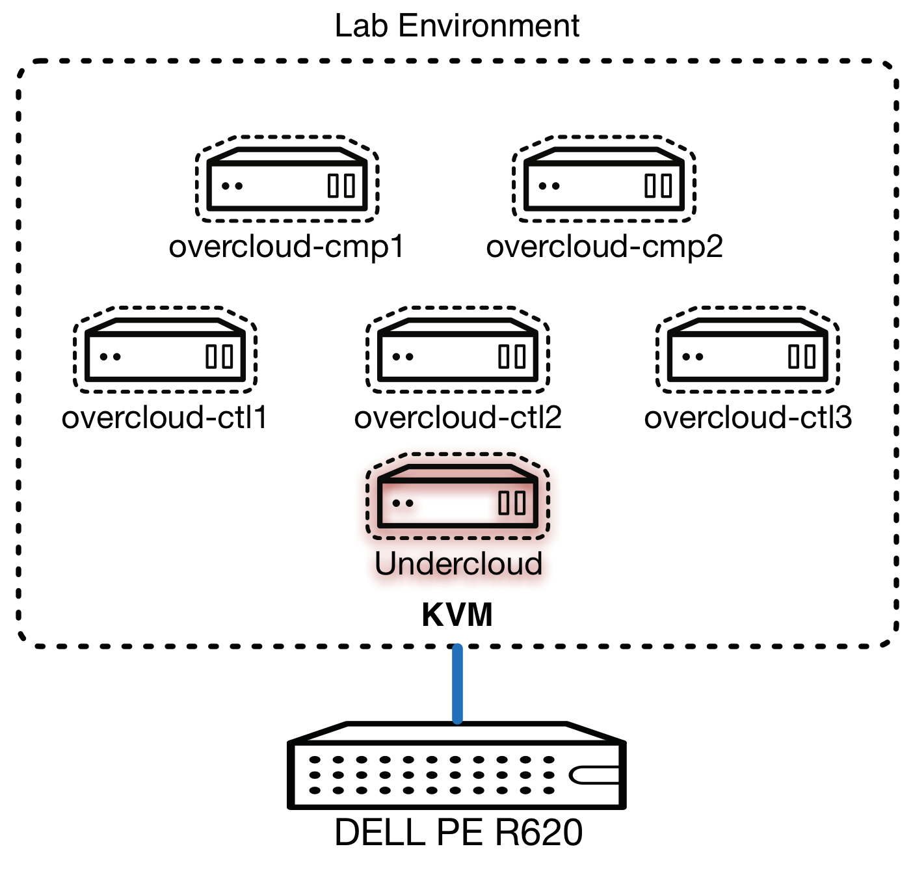

# 实验二: Undercloud 的配置

## 序言

到目前为止我们已经配置我们底层主机运行的虚拟机，将弥补我们 **undercloud** 和 **overcloud** 的基础设施。我们运行在虚拟机环境中，这给我们 **灵活性** 和 **隔离** 没有妥协的能力 *复制* 或 *模仿** **客户环境**。唯一真正的区别是，我们不得不使用的电源管理 — — 在我们的例子，它是 libvirt 虚拟机监控程序，但是客户的环境可能会某种形式的 IPMI 接口。

这第二个实验室是跟 **undercloud** 机; 配置我们要进行以下任务在这个实验室中，估计的完成时间的 **30 分钟**:

* 必要的 undercloud 软件包的安装
* 可用于 undercloud 的各种配置选项的探索
* Undercloud 以匹配我们部署的环境的配置

> **注意**: 此实验室开始假定您已经完成 [实验一] 和你设置的 undercloud 机器。如果这不是个案，请重温以前的实验。

## 实验重点

这个实验室将集中于 **undercloud** 虚拟机本身:

    

## Next Lab

The next lab will be the deployment of the undercloud, click [here][lab03](./lab03.md) to proceed.

