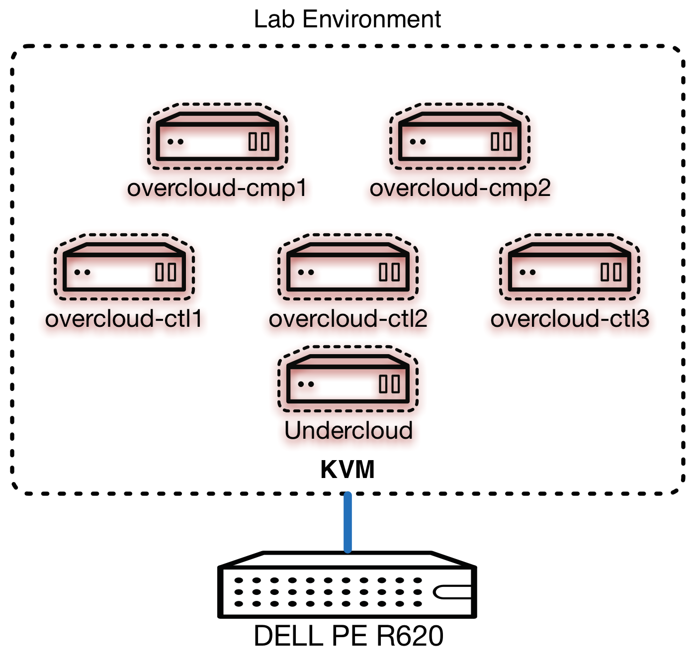

# 实验六: 部署 Overcloud

## 序言

到这一步，您已经完成了部署环境的准备。下面我们将进行 **生产云** 的部署，**生产云** 也就是 **OverCloud**
本实验预计耗时 **120** 分钟：
* 部署一个五节点带高可用的 **基础** OverCloud
* 了解部署的后台进程

## 实验对象

**undercloud** VM 和 **overcloud** VMs

## 部署前的准备

~~~
undercloud$ sudo su -
undercloud# openstack-config --set /etc/nova/nova.conf DEFAULT rpc_response_timeout 600
undercloud# openstack-config --set /etc/ironic/ironic.conf DEFAULT rpc_response_timeout 600
undercloud# openstack-service restart nova
undercloud# openstack-service restart ironic
undercloud# exit
undercloud$
~~~

指定DNS

~~~
undercloud$ source ~/stackrc
undercloud$ neutron subnet-list
undercloud$ subnet_id=$(neutron subnet-list | awk '/172.16.0.0/ {print $2;}')
undercloud$ neutron subnet-update $subnet_id --dns-nameserver 192.168.122.1
Updated subnet: 4e457dba-2a86-4f24-bc14-09466a880ca6
~~~

## 部署Overcloud

创建对应的flavor

~~~
undercloud$ openstack flavor create --id auto --ram 8192 --disk 58 --vcpus 4 baremetal
+----------------------------+--------------------------------------+
| Field                      | Value                                |
+----------------------------+--------------------------------------+
| OS-FLV-DISABLED:disabled   | False                                |
| OS-FLV-EXT-DATA:ephemeral  | 0                                    |
| disk                       | 58                                   |
| id                         | 88c20cf4-9f42-41e8-b133-3d42697d6238 |
| name                       | baremetal                            |
| os-flavor-access:is_public | True                                 |
| ram                        | 8192                                 |
| rxtx_factor                | 1.0                                  |
| swap                       |                                      |
| vcpus                      | 4                                    |
+----------------------------+--------------------------------------+
~~~

~~~
undercloud$ openstack flavor set --property "cpu_arch"="x86_64" --property "capabilities:boot_option"="local" baremetal
+----------------------------+-----------------------------------------------------+
| Field                      | Value                                               |
+----------------------------+-----------------------------------------------------+
| OS-FLV-DISABLED:disabled   | False                                               |
| OS-FLV-EXT-DATA:ephemeral  | 0                                                   |
| disk                       | 58                                                  |
| id                         | 88c20cf4-9f42-41e8-b133-3d42697d6238                |
| name                       | baremetal                                           |
| os-flavor-access:is_public | True                                                |
| properties                 | capabilities:boot_option='local', cpu_arch='x86_64' |
| ram                        | 8192                                                |
| rxtx_factor                | 1.0                                                 |
| swap                       |                                                     |
| vcpus                      | 4                                                   |
+----------------------------+-----------------------------------------------------+
~~~

确认我们的目标节点状态是 '**available**'

~~~
undercloud$ ironic node-list
+--------------------------------------+------+---------------+-------------+-----------------+-------------+
| UUID                                 | Name | Instance UUID | Power State | Provision State | Maintenance |
+--------------------------------------+------+---------------+-------------+-----------------+-------------+
| b6ef49e3-6e7a-4298-9838-71542a1d173c | None | None          | power off   | available       | False       |
| 5886e6fc-4bb1-42b3-a9ba-cbd673a71db9 | None | None          | power off   | available       | False       |
| 030e5c56-5158-4d4c-b6ff-50e459a2fde3 | None | None          | power off   | available       | False       |
| 0596a845-59b4-42ba-bf99-7f159aba75b2 | None | None          | power off   | available       | False       |
| de46c4a4-05a0-4c4e-8677-a38916436df2 | None | None          | power off   | available       | False       |
+--------------------------------------+------+---------------+-------------+-----------------+-------------+
~~~

启动部署

~~~
undercloud$ openstack overcloud deploy --templates \
    --ntp-server 10.5.26.10 --control-scale 3 --compute-scale 2 \
    --neutron-tunnel-types vxlan --neutron-network-type vxlan
Deploying templates in the directory /usr/share/openstack-tripleo-heat-templates
(...)
~~~

在另一窗口监控部署

~~~
undercloud$ heat resource-list -n5 overcloud
(...)
~~~

## 部署过程做了什么？

部署主要做了两件事

### 模板处理

告诉OSP导演采用 **/usr/share/openstack-tripleo-heat-templates/**. 去建立我们的stack。

* **/usr/share/openstack-tripleo-heat-templates/overcloud-without-mergepy.yaml**
* **/usr/share/openstack-tripleo-heat-templates/overcloud-resource-registry-puppet.yaml**

~~~
undercloud$ cd /usr/share/openstack-tripleo-heat-templates/
undercloud$ grep -A20 parameters overcloud-without-mergepy.yaml | head -n20
parameters:

  # Common parameters (not specific to a role)
  AdminPassword:
    default: unset
    description: The password for the keystone admin account, used for monitoring, querying neutron etc.
    type: string
    hidden: true
  CeilometerBackend:
    default: 'mongodb'
    description: The ceilometer backend type.
    type: string
  CeilometerMeteringSecret:
    default: unset
    description: Secret shared by the ceilometer services.
    type: string
    hidden: true
  CeilometerPassword:
    default: unset
    description: The password for the ceilometer service account.
~~~

~~~
undercloud$ grep -A20 "Controller:" overcloud-without-mergepy.yaml | head -n15
  Controller:
    type: OS::Heat::ResourceGroup
    depends_on: Networks
    properties:
      count: {get_param: ControllerCount}
      removal_policies: {get_param: ControllerRemovalPolicies}
      resource_def:
        type: OS::TripleO::Controller
        properties:
          AdminPassword: {get_param: AdminPassword}
          AdminToken: {get_param: AdminToken}
          CeilometerBackend: {get_param: CeilometerBackend}
          CeilometerMeteringSecret: {get_param: CeilometerMeteringSecret}
          CeilometerPassword: {get_param: CeilometerPassword}
          CinderLVMLoopDeviceSize: {get_param: CinderLVMLoopDeviceSize}
~~~

~~~
undercloud$ grep "OS::TripleO::Controller: " overcloud-resource-registry-puppet.yaml
  OS::TripleO::Controller: puppet/controller-puppet.yaml
~~~

    ~~~
    undercloud$ grep -A10 "OS::Nova::Server" puppet/controller-puppet.yaml
    type: OS::Nova::Server
    properties:
      image: {get_param: Image}
      image_update_policy: {get_param: ImageUpdatePolicy}
      flavor: {get_param: Flavor}
      key_name: {get_param: KeyName}
      networks:
        - network: ctlplane
      user_data_format: SOFTWARE_CONFIG
      user_data: {get_resource: NodeUserData}
      name: {get_param: Hostname}
    ~~~

    ~~~
    undercloud$ grep -A9 NetworkConfig puppet/controller-puppet.yaml | head -n9
  NetworkConfig:
    type: OS::TripleO::Controller::Net::SoftwareConfig
    properties:
      ExternalIpSubnet: {get_attr: [ExternalPort, ip_subnet]}
      InternalApiIpSubnet: {get_attr: [InternalApiPort, ip_subnet]}
      StorageIpSubnet: {get_attr: [StoragePort, ip_subnet]}
      StorageMgmtIpSubnet: {get_attr: [StorageMgmtPort, ip_subnet]}
      TenantIpSubnet: {get_attr: [TenantPort, ip_subnet]}
    ~~~

    ~~~
    undercloud$ grep -A9 NetworkDeployment puppet/controller-puppet.yaml | head -n9
  NetworkDeployment:
    type: OS::TripleO::SoftwareDeployment
    properties:
      config: {get_resource: NetworkConfig}
      server: {get_resource: Controller}
      input_values:
        bridge_name: br-ex
        interface_name: {get_param: NeutronPublicInterface}
    ~~~

## Next Lab

The next lab will be the testing of our fresh overcloud deployment, click [here][lab7](./lab07.md) to proceed.
